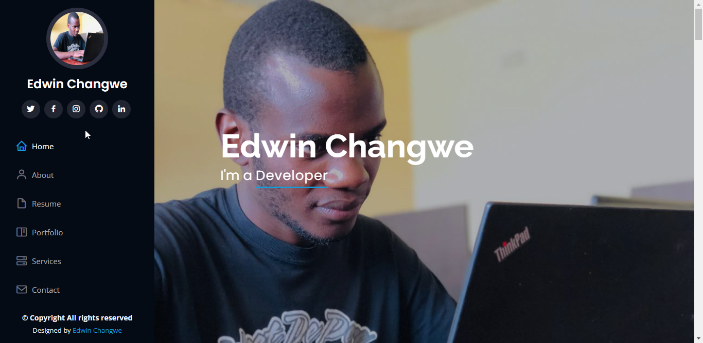
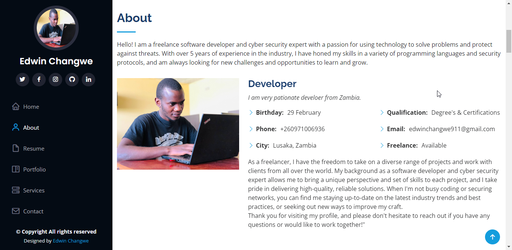
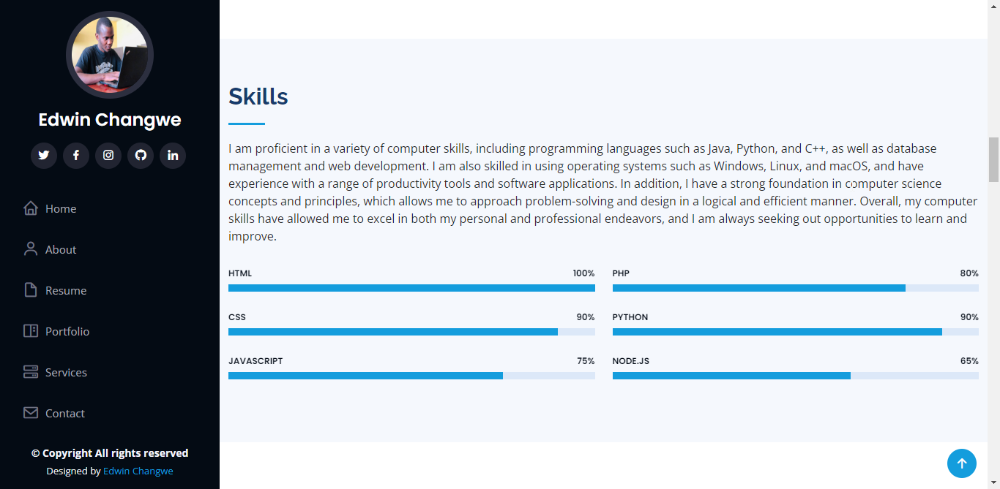
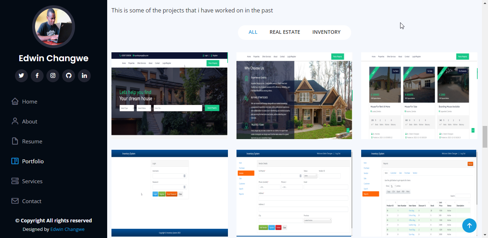
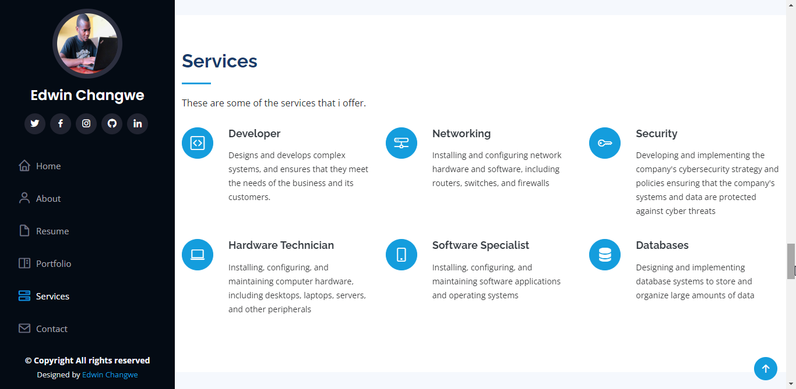
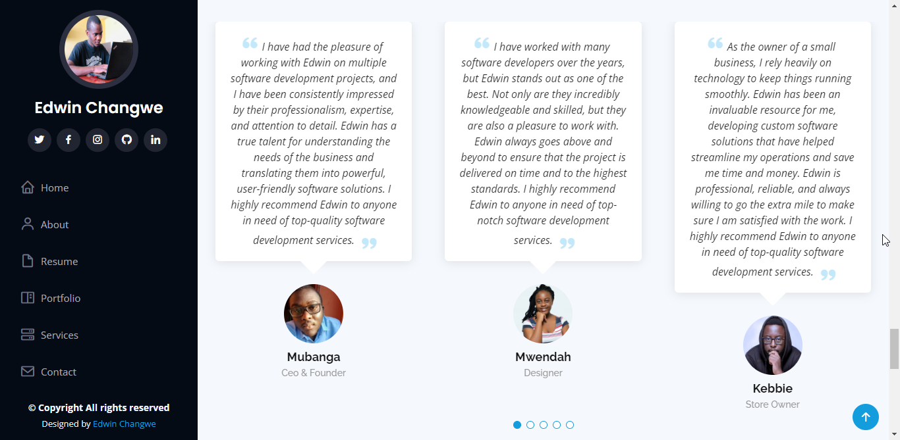
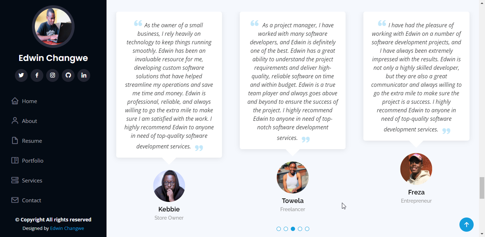

<h1 align="center">Portfolio</h1>

This is just a templet of a portfolio that i designed. Feel free to reuse the code in your project

---------
# Features
- Nice interface

---------
# Screenshots

<h1 align="center">Landing Page</h1>

---------

<h1 align="center">About</h1>

---------

<h1 align="center">Skills</h1>

---------

<h1 align="center">Projects</h1>

---------

<h1 align="center">Services</h1>

---------

<h1 align="center">Testimonials</h1>

 

---------

See it in action: <a href="https://edwinchangwe-portfolio.netlify.app/" target="_blank">My Portfolio</a>
